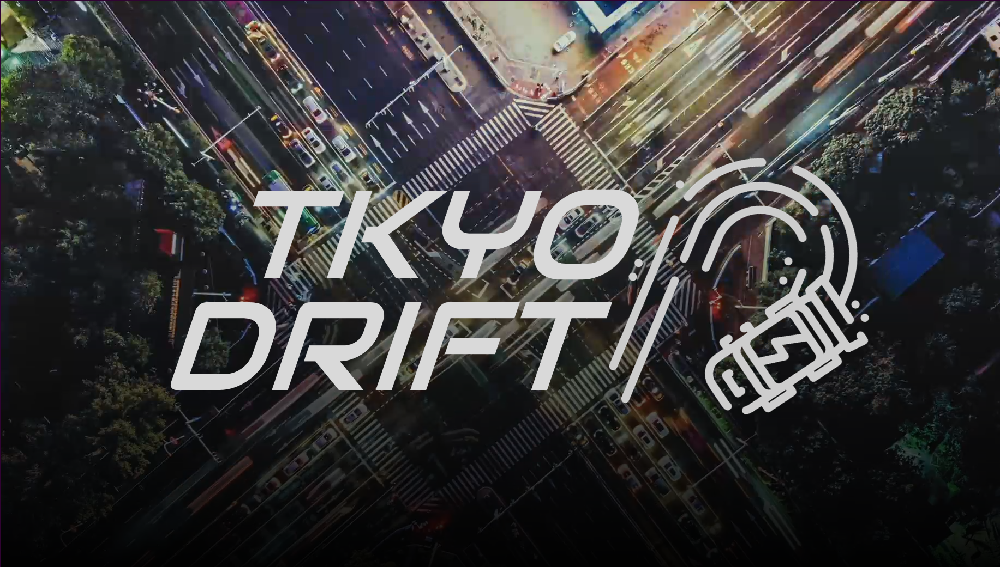
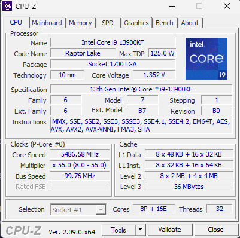

<p align="center">
  
</p>

# AI Temporal Knowledge Yield Output Drift Tracker (TKYO Drift)


TKYO Drift is a lightweight, transparent AI drift tracking library for AI workflows of any complexity. It embeds text inputs and compares them to a configurable baseline to detect both drift in an individual input's semantic, conceptual, or lexical meaning over time, as well as population distribution stability across a range of scalar metrics.

**At the time of writing, this tool is only able to ingest data from mono modal text AI workflows.**

## Overview

TKYO Drift is a lightweight drift tracking framework for modern AI workflows. It monitors the _meaning_, _structure_, and _consistency_ of text-based interactions over time to help you catch when an AI model, a user, or both start to change their behavior.

**Why does this matter?**

In production, even minor changes to prompts, model weights, or input phrasing can cause subtle shifts in how your model responds, what it says, how long it is, whether it maintains tone, intent, or factual alignment. These shifts are often invisible unless you're actively tracking them.

And it’s not just the model: user language evolves too. New slang, trending phrases, or tone shifts may emerge that your model wasn't trained on and without observability, you'll miss them.

TKYO Drift embeds each message and compares it against a configurable baseline using **Cosine similarity**, **Euclidean distance**, and scalar features like **punctuation density**, **entropy**, and more. The result is a continuous record of how your model’s and users’ behavior changes over time.

Use it to answer questions like:

- "Has the assistant started responding more verbosely?"
- "Are our summaries becoming more extractive?"
- "Did a model update change how we paraphrase?"
- "Are the kids using newfangled words that don’t make any sense?"

Just keep in mind that this tool doesn't tell you why you are drifting, only that you are, by how much, where, when, and in what direction.

## Table of Contents

- [Drift Analysis Flow](#drift-analysis-flow)
- [How do you install this thing?](#how-do-you-install-this-thing)
- [How do you use this thing?](#how-do-you-use-this-thing)
- [One-off Ingestion](#one-off-ingestion)
  - [Production Impact](#production-impact)
- [Training Ingestion](#training-ingestion)
- [Logging](#logging)
  - [Format](#format)
- [CLI Tools](#cli-tools)
  - [printLogCLI.js](#printlogclijs)
  - [printScalarCLI.js](#printscalarclijs)
- [Architecture Decisions](#architecture)
  - [Embedding Models](#embedding-models)
  - [JS/Python Pipeline Split](#jspythons-pipeline-split)
  - [Drift Types](#drift-types)
  - [Baseline Types](#baseline-types)
  - [Binary Embedding Storage](#binary-embedding-storage)
  - [IO Write/Read Methods](#io-writeread-methods)
  - [HNSW Indexing](#hnsw-indexing)
- [The Math](#the-math)
  - [Cosine Similarity & Euclidean Distance](#cosine-similarity--euclidean-distance)
  - [How we get the Baseline (B)](#what-b-represents)
  - [Centroid Calculation](#centroid-calculation)
- [Scalar Metrics](#scalar-metrics)
  - [How Are They Calculated?](#how-are-they-calculated)
  - [What Do They Tell Us?](#what-do-they-tell-us)
  - [Comparison Logic](#comparison-logic)
  - [PSI Values (Population Stability Index)](#psi-values-population-stability-index)
- [Future Iterations](#future-iterations)
- [Contributing](#contributing)
- [License](#license)
- [Acknowledgments](#acknowledgments)

## Drift Analysis Flow

For each individual input to the TKYODrift, the following workflow is performed:

1. Generate an embeddings for input.
2. Save it to the rolling `.bin` files (one per model).
3. Load historical vectors from disk.
4. Compute baseline vectors as an average of past embeddings.
5. Calculate cosine similarity.
6. Calculate euclidean distance.
7. Capture scalar metrics.
8. Append results to `COS_log.csv`, `EUC_log.csv`, and scalar metric files.

```
Note that the size of input/output text, embedding dimensions, and how many embedding models are chosen will influence the speed of the workflow. Regardless, tkyoDrift() is asynchronous, and it should not impact your workflow unless you expect a sustained high volume of user inputs per second.
```

# How do you install this thing?

TODO: Update this when the NPM package is built.

1. Install the NPM package:

```bash
npm install tkyoDrift
```

2. Install the Python Dependencies:

```bash
pip install -r ./node_modules/TKYODrift/requirements.txt
```

3. Import tkyoDrift into your AI workflow pages:

```js
import tkyoDrift from tkyoDrift
```

4. Add a function call to `tkyoDrift(text, inputType)` passing in your text and input type name:

```js
...
tkyoDrift(userSubmission, 'input')
...
```

5. Enjoy the benefits of having drift detection:

```
🏎️☁️☁️☁️ <- THAT GUY IS DRIFTING
```

# How do you use this thing?

TODO: Update this after NPM is built

You can interact with this library in a couple ways;

- Dispatch a one-off text input and input type to `tkyoDrift()`
- Dispatch training data through a batch upload\* to `tkyoDriftSetTrainingHook()`
- Request a CLI print out of the Cosine Similarity log's summary using `npx tkyoDrift #` (where # is a number of days)
- Request a CLI print out of the scalar metric's log using `npx tkyoDrift scalar`
- Export the logs into your Data Viz platform

```
* Do this from a strong PC, and then copy your data into the appropriate folders. Due to a number of factors (amount of data, length of individual records, lack of CUDA access, lack of memory, lack of cpu cores, count of embedding models) this process can take an exceptionally long time to complete.
```

There is also a small training file downloader script in the util folder called downloadTrainingData.py that you can run to grab the training data from hugging face if you happen to be using a model for your workflow from there.

## One-off Ingestion

`tkyoDrift.js(text, type)` handles individual inputs for drift comparison. It:

- Accepts two text strings as `input` and `ioType` parameters.
- Embeds using as many models as you specify (default 3).
- Appends to the rolling data file (only).
- Reads from the rolling (and training, if it exists) data files to load a baseline for comparison.
- Computes the scalar metrics for the input.
- Computes the drift score using cosine similarity.
- Computes the euclidean distance
- Adds it to the logs.

---

### Production Impact

TKYODrift is designed to run asynchronously in a backend environment, making it ideal for integration as a **non-blocking observer** in production AI workflows.

When the one-off embedding mode is called as above, the system runs as a 'fire-and-forget' process that will record scalar and vector drift without delaying the user response. **Latency impacts are limited to system throughput, not response time**.

To minimize load overhead, TKYO Drift includes an internal `MODEL_CACHE` that persists transformer models (e.g., semantic/conceptual/lexical encoders) in memory between requests. When used in a **warm backend process**, this prevents the need to reload model weights on each call, which saves up to **52%** of total runtime, as seen in the performance breakdown below.

Drift tracking can be injected at any point in the pipeline where raw text data is available:

- User input → `tkyoDrift(text, "input")`
- Auto CoT response → `tkyoDrift(text, "cotIntercept1")`
- System prompt → `tkyoDrift(text, "system")`
- Another CoT response → `tkyoDrift(text, "cotIntercept2")`
- Assistant response → `tkyoDrift(text, "output")`

The result is a production-safe drift observability layer that provides transparency across evolving I/O behavior with minimal runtime impact and full logging.

| Stage in order of impact          | Avg Time (ms) | % of Total Time | Spread (ms) |
| --------------------------------- | ------------- | --------------- | ----------- |
| Load the Xenova Models            | 563           | 52.5%           | 125         |
| Read Bin Files                    | 256           | 23.9%           | 51          |
| Get Embeddings                    | 250           | 23.3%           | 232         |
| Save Embedding Data               | 1.42          | 0.13%           | 2           |
| Get Shared Scalar Metrics         | 0.81          | 0.08%           | 1           |
| Make & Append Log Entries         | 0.35          | 0.03%           | 0           |
| Save Scalar Data                  | 0.32          | 0.03%           | 0           |
| Get Cosine Similarity             | 0.28          | 0.03%           | 0           |
| Get Euclidean Distance            | 0.17          | 0.02%           | 0           |
| Get Model Specific Scalar Metrics | 0.10          | 0.01%           | 0           |
| Get Baseline                      | 0.09          | 0.01%           | 0           |
| Initialize Model File Pathing     | 0.06          | 0.01%           | 0           |
| Construct Model Combinations      | 0.02          | 0.00%           | 0           |

This table represents a sample runtime breakdown of the one-off embedding flow, measured using the default models in a local Node.js environment with this hardware:



Your actual performance will vary depending on:

- Hardware (CPU vs GPU, disk speed)
- Token length and input size
- Number and type of models used
- Warm vs cold model state

Depending on whether or not your workflow keeps the cache alive this system should be capable of ingesting **1–2 inputs per second** without bottleneck.

Higher throughput is achievable by **batching**, **spawning workers**, or using selective sampling methods to reduce the number of total function calls.

Since the process is fully async and non-blocking, TKYO Drift can be safely parallelized across multiple server threads or microservice instances, allowing it to scale horizontally with user traffic if you need it to.

For higher-frequency use cases (e.g., token-level drift or live CoT chains), we recommend:

- Deploying TKYO Drift in a **separate worker queue**
- Or integrating it as part of **scheduled post-analysis**, not in-line evaluation

## Training Ingestion

`tkyoDriftSetTraining.js(filepath, columnName, ioType)` handles full dataset ingestion for baseline creation. It:

- Accepts a filepath that contains `columnName` and how you want to reference it as `ioType`.
- Captures text level, model independent scalar metrics.
- Embeds each input in chunks of 10, with 8 in parallel for performance, once for each model type.
- If needed, calculates the average values for embeddings that are longer than 512 tokens by embedding 512 token chunks and then averaging across the set.

```
IMPORTANT! The set training data file should ONLY be run when you intend on replacing the existing tkyoDrift training data file set. This function will obliterate any existing tkyoDrift training files, by design.

There should only be ONE set of ideal embeddings for your training data, per ioType.
```

As an additional note, the batch embedding tool is designed to indiscriminantly ingest all `.arrow` files in the directory you specify. If needed, nest your training data in a subdirectory to avoid ingesting data other than your intended files.

---

### Example Input Structure:

Should you have access to training data, you must choose an ioType to associate it with. Preferably, you choose tags for your training data that also exists in your expected one-off function calls to `tkyoDrift(text, ioType)`. For example, a training dataset that contains problem/solution should have the problem paired with new user inputs (by giving them the same tag), while the solution should be paired with new AI outputs (by giving these the same tag).

In general, the idea is that **a training baseline is only comparable against data that shares the same ioType**, which is how the system will know which rolling data corresponds with what training data.

When passing the file path, column header, and tag name into the `tkyoDriftSetTrainingHook.js` function, your object can be structured in the following way:

---

#### Format 1: Flat Columns

If your dataset is structured like this:

```json
{
  "input": ["Hello", "How are you?"],
  "output": ["Hi!", "I'm fine."]
}
```

You can call:

```js
tkyoDriftSetTraining(dataPath, 'input', 'userInputText');
tkyoDriftSetTraining(dataPath, 'output', 'aiOutputText');
```

Where the second argument is the key in the object you want to embed, and the 3rd argument is some semantic name you choose for that key.

---

#### Format 2: Nested Fields (OpenAI-style)

If your data has nested fields, such as:

```json
{
  "conversations": [
    { "role": "user", "value": "Hello" },
    { "role": "assistant", "value": "Hi there!" }
    { "role": "system", "value": "You're a bot, harry!" }
  ]
}
```

You can use bracket notation to specify the path:

```js
tkyoDriftSetTraining(dataPath, "['conversations'][0]['value']", 'user');
tkyoDriftSetTraining(dataPath, "['conversations'][1]['value']", 'assistant');
tkyoDriftSetTraining(dataPath, "['conversations'][2]['value']", 'system');
```

Where once again the second argument is the location within the array you would like to embed, and the third argument is some semantic name you choose for each data type. This lets you embed specific messages or roles within a conversation.

---

#### Format 3: Dictionary of Lists (Batch-style)

Some HuggingFace Datasets may return data like this during `map()` operations:

```json
{
  "input": ["Problem 1", "Problem 2", "Problem 3"...],
  "output": ["Solution 1", "Solution 2", "Solution 3"...]
}
```

This is also supported — each row will be reconstructed before accessing your field. Just call the function like so:

```js
tkyoDriftSetTraining(dataPath, 'input', 'problem');
tkyoDriftSetTraining(dataPath, 'output', 'solution');
```

Again, the second argument is the key for the object you would like to embed and the third argument is a semantic name you choose for that data type.

## Logging

Results are stored in two CSV files (`COS_log.csv` & `EUC_log.csv`) with dynamic headers. Each one-off run appends one row to each file. Keep in mind that training data is not added to the log, as the assumption is that your training baseline is what we compare against to measure drift.

### Format

For the cosine similarity log:

```
ID, TIMESTAMP, I/O TYPE, SEMANTIC ROLLING COS, SEMANTIC TRAINING COS, CONCEPT ROLLING COS...
```

For the euclidean distance log:

```
ID, TIMESTAMP, I/O TYPE, SEMANTIC ROLLING EUC, SEMANTIC TRAINING EUC, CONCEPT ROLLING EUC...
```

- Cosine similarities and euclidean distances are recorded per model and baseline type.
- Additional metadata like ioType, date and UUIDs are included for tracking.
- Neither the log, nor the binary files, contain your users input or AI outputs. This data is not necessary to calculate drift, and its exclusion is an intentional choice for data privacy.

```
Note: if you add or remove model types to the tkyoDrift tracker, the log will break. Please ensure you clear any existing logs after altering the embedding model names. What we mean here, is that if you change your lexical model from "lexical" to "linguistic" when writing to the log, the makeLogEntry method of the Drift Class would work, but the log Parser would fail.

Keep in mind, however, you can change models any time you like, though that will brick your drift calculations for a different reason; your inputs/outputs will be embedded with dissimilar methods, which would lead to inaccurate drift calculations.
```

## CLI Tools

TODO: Add the command we need people to enter to trigger this log here after the NPM package is built.

### `printLogCLI.js`


Parses `COS_log.csv` and displays violation counts and average cosine similarities over a selected number of days. Uses a color-coded table (green/yellow/red) to show severity of drift. Thresholds are set in this file, and should be adjusted to your expected precision needs.

```
Note: The first record you enter into this system will always show that there is 0 drift when compared against the rolling data set. This is because the rolling dataset will be compared against itself at that point and there will be no drift to detect. This is not a known issue, and was an intentional choice. The alternative would be to exclude a write to the `COS_log.csv` and `EUC_log.csv` logs on first write.

If this bothers you, you can remove line 2 from the COS and EUC logs after you use this system at least twice.
```

### `printScalarCLI.js`


This tool parses the scalar jsonl files to calculate scalar distributions across the training and rolling datasets and delta mean and delta standard deviation between the two distributions. L2 norm is an embedding model specific metric, and will be captured once per model while all others are input specific and are captures once per input. Uses a color-coded table (green/yellow/red) to show severity of drift. Thresholds are set in this file, and should be adjusted to your expected precision needs.

The scalar metrics the system is currently tracking are listed below:

| Metric               | Description                                                    |
| -------------------- | -------------------------------------------------------------- |
| `norm`               | Vector magnitude (captures changes in embedding length/energy) |
| `textLength`         | Raw character count of the input/output text                   |
| `entropy`            | Character-level entropy (measures information density)         |
| `avgWordLength`      | Average word length (indicates language complexity)            |
| `punctuationDensity` | Ratio of punctuation to characters (captures tone/stylistics)  |
| `uppercaseRatio`     | Ratio of uppercase letters (detects emphasis or acronyms)      |

```
Note: Without batch embedding your training data, scalar metric comparison will run in hybrid mode, which compares the oldest 10,000 inputs against the most recent 1,000 inputs from the rolling file. This simulates a baseline when you haven't provided one through the training batch embedding process. These values can be modified in `util/loadScalarMetrics.js` if needed.
```

# Architecture Decisions

### Embedding Models

TKYO Drift uses remote embedding models on HuggingFace.co for inference using the Xenova Transformers library in javascript or the python native hugging face library in python. By default, the system operates in JavaScript using a lightweight transformer pipeline, with Python scripts injected as required to improve speed when performing batched operations. The python equivalent embedding pipeline uses MPS → GPU → CPU depending on what system you are using and whether you have the appropriate NVIDIA CUDA drivers.

- `all-MiniLM-L12-v2`: Used for semantic drift or changes in tone or communication style.

  https://huggingface.co/Xenova/all-MiniLM-L12-v2

  https://huggingface.co/sentence-transformers/all-MiniLM-L12-v2

- `e5-base-v2`: Used for concept drift or changes in topic or intent.

  https://huggingface.co/Xenova/e5-base-v2

  https://huggingface.co/intfloat/e5-base-v2

- `all-MiniLM-L6-v2`: Used for lexical drift or changes in word choice.

  https://huggingface.co/Xenova/all-MiniLM-L6-v2

  https://huggingface.co/sentence-transformers/all-MiniLM-L6-v2

While L6 is a subset of L12, it is also the case that lexical drift is a subset of semantic drift. This model can be disabled in both `tkyoDrift.js` and `util/tkyoDriftSetTraining.py` if you believe that MiniLM-L12 is comprehensive enough to provide drift tracking for both types. This speeds up one-off and batched operations by about 10%.

You might be thinking: "Can I serialize a loaded model to disk and reuse it?"

In practice, Hugging Face models are already cached locally in ~/.cache/huggingface (or your platform's path) but their in-memory representations (tokenizer + model) can't be deserialized efficiently from Node in a raw form.

So no, there's no good way to "freeze" a pipeline( ) and reload it faster... unless... you download the `.safetensor` and run it locally.

### JS/Python Pipeline Split

While the Xenova transformer library is a javascript equivalent of the Hugging Face python transformer library, the primary difference is that the former was made for JS by the xenova team while the latter was made for Python by huggingface themselves. The HF library allows for GPU acceleration, which is why it was chosen for batched calls. In either case, we are using the same transformer library for the same purpose. As such, Xenova/Hugging Face Transformers were chosen as the preferred choice of transformer libraries because:

- Embedding models are quite large, and including a wget or some other form of downloading models to run locally would require dealing with user authentication for the huggingface.com site, which we wanted to avoid.
- People have good internet now, mostly, so we can get away with streaming the model conclusions to the workflow environment without dealing with a local model.
- Using wasm for the embedding pipeline lets people hot swap models without having to replace safetensors.
- Spawning a python child process to load the model on each individual input has huge overhead, and being able to store the models to a cache in JS is a good work-around.

### Drift Types

Drift is detected across combinations of:

- `modelType`: semantic, concept, lexical
- `ioType`: a string you specify
- `baselineType`: rolling, training

This results in six cosine similarity and euclidean distance comparisons (assuming you use the default models) for each ioType you declare. Since all drift calculations are performed against the same ioType, each specified type will increase your file counts linearly.

- All embeddings are pooled across all input tokens to get mean values from the input
- All embeddings are saved without normalization, but are normalized before COS similarity comparisons.
- Models are loaded sequentially and cached globally to reduce loading time.

Note that once the execution context window closes for the processing input, models are naturally unloaded. Unless you feel inclined to download and store the models locally in your production pipeline, this is a necessary and unavoidable ~500ms workflow speed penalty. See the Production Impact section above for more information on how to minimize this impact.

```
Drift detection in the scalar metrics is ONLY available when a training dataset is provided, as scalar metrics are comparisons in distribution shape. In other words, without both distributions to compare against, there is no comparison to make.
```

### Baseline Types

- `Rolling`: A sliding baseline using the most recent N (default 1,000) examples.

The rolling baseline represents the accumulation of inputs and outputs as they are triggered by the production pipeline. As inputs are dispatched to the drift analysis workflow, each input is saved to the rolling baseline file. When drift calculations are generated, they exclude the newest input for that individual calculation but will include them in all subsequent operations. If you are feeling brave, you can update this value in both `pythonHNSW.py` and `loadScalarMetrics.js`.

- `Training`: A fixed baseline built once from a full dataset.

The training baseline represents the set of inputs used to generate the initial model AI responses, which are ingested by running the 'tkyoDriftSetTraining.py' script. This script performs a batch analysis of a single input column used in the training set and creates an artificially 'locked' training file that can not/will not be be appended to over time. Theoretically, you should only need to update this when you have retrained your model, but you will need to run it once for each ioType in your training data.

- `Hybrid`: Use the rolling file to provide oldest K (default 10,000) and newest N (default 1,000) simultaneously.

In the event that there is no training data supplied to the system, the Drift analyzer will use the oldest K values entered into the rolling file to represent mock 'training' data, while the newest K values represent the 'rolling' data. This allows us to compare drift against an anchor point to see drift over time, while still having a rolling window to see shock impacts to the system caused by new concepts/semantics/lexicon.

### Binary Embedding Storage

Embeddings are saved in `.bin` files using float32 for efficient storage. We chose to make a custom bin writer and reader because bins have tiny overhead and force us to drop repeating characters like object braces and array brackets. Since this system is intended to work with potentially millions of embeddings, this minimizes disk I/O and enables fast appending.

- Each file is named: `{modelType}.{ioType}.{baselineType}.bin`

This yields `(models * I/Os * baselines)` file combinations, and at the minimum should represent one file if you are using a single drift model for a single ioType using only the rolling baseline.

At the time of writing, the default models in this library have either 768 or 384 dimensions per input.

| Model               | Purpose                         | Dimensions | Bytes per Input (float16) | File Size (1,000,000 inputs) |
| ------------------- | ------------------------------- | ---------- | ------------------------- | ---------------------------- |
| `all-MiniLM-L12-v2` | Semantic (communication method) | 384        | 768 bytes                 | ~750 MB                      |
| `e5-base-v2`        | Concept (communication intent)  | 768        | 1,536 bytes               | ~1.5 GB                      |
| `all-MiniLM-L6-v2`  | Lexical (syntax)                | 384        | 768 bytes                 | ~750 MB                      |

Note: 1 MB = 1,048,576 bytes (binary MB), but here we're rounding to 1 MB = 1,000,000 bytes for simplicity.

Scalar files are negligibly large, and even with 1 million records, they should be less than 250 MBs. Additionally, the Log files themselves are miniscule.

```
The rolling files have no upper limit on their size, and will require manual pruning eventually depending on your workflow's throughput. Incidentally, if you do not have access to your training data (you may be using a 3rd party model without a published data set) you may benefit from renaming your rolling files to training files after you have accumulated at least 10,000 entries.
```

**_Write operations are performed on only the rolling file set, as training files are explicitly and intentionally excluded from write operations outside of the batched training embedding pipeline._**

This intentional decision reflects the nature that training datasets represent a fixed point in time, and should not be modified after being ingested. Throughout this codebase, there are checks for a model's baseline type, and if that baseline is set to `training', write operations are skipped.

As a way of making this system work where there is no training data provided, the system will attempt to use hybrid mode using the rolling file path locations as replacements for the training file paths when generating COS/EUC scores for new inputs.

In hybrid mode, because the first N vectors are considered training vectors, and the last K vectors are considered rolling vectors, there will be a duration of time that training and rolling datasets will be equivalents. For example, when the system only contains 1500 vectors, all 1500 will be considered `training` and the most recent 1000 would be considered `rolling`.

### IO Write/Read Methods

File writing/reading is performed using `fs.promises.writeStream` and `fs.promises.readStream` due to the obscene number of floats we need to read, parse and then calculate against, which necessitates that vectors be constructed during the read process to avoid memory overflows. This is an intentional tradeoff of speed for deployability. If you know your system has the memory to spare, IO ops can be improved by replacing write/read streams with loads-to-memory. This would be done in the `DriftModel.js` file, inside the `readFromBin` and `saveToBin` methods.

### HNSW Indexing

HNSW (Hierarchical Navigable Small World) allows us to support approximate nearest neighbor queries on stored embeddings. This allows for:

- Fast lookup of drift clusters
- Identification of nearest historic I/O pairs
- Calculation of sub cluster centroids within general text AI model training data.
- N(logN) lookup across (theoretically) millions of embeddings.
- Tunable accuracy and recall settings.

HNSW creation is factored into the `readFromBin()` model class method (which calls on `pythonHNSW.py`), and is fast enough that we re-calculate the HNSW on every read.

```
If this feels inefficient to you, the code in pythonHNSW.py can be refactored to use the saveIndex and loadIndex methods an HNSW index file read an existing index from disk. @ 50,000 embeddings, building the HNSW added 5ms to the process so we opted not take this step.
```

# The Math

The core calculation behind drift tracking is **cosine similarity**, which evaluates the angle between two vectors in high-dimensional space, ignoring their magnitude. This is ideal for comparing semantic or conceptual distance between two pieces of text.

## Cosine Similarity & Euclidean Distance

The cosine similarity between two vectors **A** and **B** is calculated as:

`cosine_similarity(A, B) = (A · B) / (||A|| * ||B||)`

Where:

- `A · B` is the dot product of vectors A and B.
- `||A||` is the magnitude (L2 norm) of vector A.
- `||B||` is the magnitude of vector B.

The result is a value between -1 and 1. For normalized embedding vectors (as used here), the output is always between 0 and 1:

- `1.0` → Identical direction (no drift)
- `0.0` → Orthogonal (maximum drift)

Normalization ensures magnitude doesn’t influence the result, so only the _direction_ of the vector matters. Additionally, we are calculating the Euclidean Distance. This metric is not scale-invariant and is typically larger in magnitude. It’s useful in conjunction with cosine similarity to detect both directional and magnitude-based drift.

## How we get the Baseline (B)

In the context of TKYO Drift, **B** is the _baseline vector_ against which a new embedding (**A**) is compared. It represents the average of historical embeddings from either:

- The **rolling baseline**, which reflects the most recent N inputs/outputs in production.
- The **training baseline**, which reflects embeddings generated from your original training dataset.
- Or both (in hybrid mode), where the system simulates a static baseline from the start of the rolling file.

This averaged baseline acts as a reference point. If the direction of the new embedding (A) starts to diverge from (B), it indicates a potential drift in communication, concept, or syntax.

## Centroid Calculation

Since the B value in question is the basis for the drift comparison, it is imperative that the B value here be the average centroid node of whatever sub cluster of nodes exists within a training or rolling data set closest to the A value.

This is where K-Means analysis comes into play, allowing us to condense a large input dataset into a smaller set by identifying how many sub clusters exist, and calculating each of their respective centroids.

From this smaller set of centroids, we use HNSW to find the closest centroid for the B value, which is then used to calculate the cosine similarity and euclidean distance.

Notably, this is a tradeoff between accuracy and speed, as KMeans cluster analysis will generate a centroid for each cluster and not provide the actual nearest neighbor. If this is a problem for your workflow, you can disable the KMeans analysis to always find the nearest neighbor from the training set.

This system uses `(num_of_clusters = int(np.sqrt(num_vectors / 2)))` to determine the number of clusters to generate, as we do not have the ability to use the elbow method to determine the proper value for K.

## Scalar Metrics

In addition to vector-based drift (cosine similarity and Euclidean distance), TKYO Drift also tracks **scalar metrics**, or individual numerical features extracted from the raw text of your inputs. These scalar values help capture shifts in text structure, tone, or complexity that may not be reflected in semantic embeddings.

### How Are They Calculated?

Each metric is computed as follows:

- `norm`: L2 norm (vector magnitude) from the output embedding.
- `textLength`: Length of the raw string.
- `entropy`: Shannon entropy over character frequencies.
- `avgWordLength`: Mean word length based on whitespace splitting.
- `punctuationDensity`: Punctuation count divided by total chars.
- `uppercaseRatio`: Uppercase count divided by total chars.

These are implemented in both JS (for rolling ingestion) and Python (for training ingestion) and saved alongside vector data.

### What Do They Tell Us?

Scalar metrics help detect **non-semantic drift**. For example:

- A spike in `uppercaseRatio` may indicate aggressive or stylized tone.
- A drop in `entropy` could mean the system is outputting simpler or repetitive responses.
- A change in `textLength` may point to output truncation or verbosity.

In general, scalar drift reveals changes in _how_ your model or users are communicating, not just _what_ it's communicating.

### Comparison Logic

Drift is measured by comparing the **mean** and **standard deviation** of each metric between the training and rolling baselines.

For each metric:

```
meanDelta = rollMean - trainMean
stdDelta  = rollStd  - trainStd
```

These deltas are printed in the CLI printout with color-coded thresholds (green/yellow/red) to indicate severity using the distribution's standard deviation for color coding. Within 1 stDev is green, within 2 yellow, outside of 2 will be red.

### PSI (Population Stability Index) Values

TKYO Drift calculates the **Population Stability Index (PSI)** for all scalar metrics when comparing rolling data against the training baseline. PSI quantifies how much a distribution has shifted over time, and is commonly used in production monitoring to detect silent model degradation.

For each scalar metric, the PSI score is computed using automatically configured bins and normalized frequency distributions from both the rolling and training datasets.

The PSI interpretation follows standard thresholds:

| PSI Value | Interpretation                  |
| --------- | ------------------------------- |
| < 0.1     | No significant drift            |
| 0.1–0.25  | Moderate shift; monitor closely |
| > 0.25    | Major shift; model drift likely |

These scores are included in the scalar metric CLI drift output and provide a statistically grounded way to monitor changes in features like entropy, token length, or word complexity — even if the semantic embeddings remain stable.

# Future Iterations

For this project there are a number of ways this platform could be made better, including:

### Rolling Data Selection

The rolling file currently uses a fixed number of records when loaded during the readFromBin method on the DriftModel class, this fixed number may not be a flexible enough method of selecting the number of records to compare for rolling drift. It would be an improvement to modify this so that it uses entries from the last N days instead.

Building this would require adding a date to the binary file write method to store when a file was added, or replacing the binary file writer entirely and switching to a different file storage format. Regardless, at the time of this readme writeup, there is no date associated with stored vectors and so there is no way to have the rolling file use the last N days of records instead of a fixed count.

### Picking a better K value

The current implementation sets K using a heuristic: K = int(sqrt(num_vectors / 2)), which balances clustering granularity with speed. While the elbow method offers a more statistically grounded way to choose K by evaluating clustering performance across several K values, it is computationally intensive.

Implementing the elbow method would require running KMeans multiple times and analyzing metrics like SSE or silhouette scores. Given our real-time and batch constraints, we avoid this due to diminishing accuracy gains (often logarithmic) versus increased computational cost (often linear to exponential with larger datasets).

However, since this value can be derived during the batch ingestion, when performance is not a priority, you could add it there. :)

### Python vs Javascript

This project was initially built as a pure javascript project to enable wider deployment, but various functions and libraries were originally built, and intended to be used in python. As a result, this project was refactored after an initial test build to include a javascript pipeline for individual embeddings and a python version for batched embeddings. For example, you cant use GPU acceleration in the javascript pipeline, but you can in the Python one.

What this means is that the `tkyoDriftSetTraining.py` file and the `tkyoDrift.js` processes are functionally duplicates of each other except that the former is explicitly meant to be called once for a batch, while the later is meant to be invoked on every new input.

This is fine as it is, but since many javascript libraries are just python scripts wearing a disguise, it would be ideal to rebuild this entire platform in python with a javascript NPM package to install it, and a javascript function hook to pass data into it. This would allow this system to avoid unnecessary conversion from javascript into python to execute AI embeddings, calculate K means, or generate the HNSW index.

### PSI Logging

At the time of writing, this project does not log PSI values to a csv file. This means that while PSI values are calculated on demand using the `printScalarCLI.js`, there are no exportable scalar metrics for external data visualization tools.

Fixing this would involve adding a cronjob to compare scalar metrics on an interval, or adding a counter of some sort and triggering a scalar comparison every N (10? 100?) new inputs. If the output of this comparison is sent to a log instead of the CLI, it would be consumable by external tools.

Theoretically the data is still accessible in the JSONL files, but there are many of those, and rigging them together to get a complete picture is tedious.

### Cloud Based embedding services

Waiting is pain, and embedding hundreds of thousands of inputs over and over again can take a long time. Not to mention that larger models take up a ton of space (1 mill inputs for 3 models for both baselines is like 6 gbs). This whole platform could be a paid service where people upload their I/Os and you keep their embeddings remotely.

Not only that, but there is a vast range of data visualizations that could be made, warning and alerts, recommendations based on what flags are getting triggered, etc.

This would involve creating a whole front end with user login, a backend API to receive one off calls and a file upload system to receive massive training data files. This would be a fun project in it's own right, but obviously involves cloud server costs to rapidly process embeddings. If you do decide to make a business out of this, give us a call, we would love to help.

### Multi-Modality

This project is only developed to be able to ingest text data, but there are many AI workflows out there. A future iteration of this project could include text2img, img2img, text2video, img2video, etc.

Most of the ground work for this is already done, but new embedding models specifically designed for those types of workflows would need to be incorporated, along with file type handling which is missing in the main workflow. (As in, if you pass anything other than text into the main or batch embedding function, they break.)

### More Math

We are currently calculating a number of metrics from both individual vectors as well as populations across the training and rolling data sets. There is room for improvement, however, in that there are additional drift measures such as KL divergence and Earth Movers distance that would be useful to calculate in this workflow.

It is our opinion that either of these could be added to the tkyoDrift analysis with minimal effort, as the `tkyoDrift` main logic `tkyoDriftSetTraining.py` batch embedding logic both capture scalar metrics for population comparisons already.

### Testing Battery

Its worth building. We should have. We didn't.

## Contributing

We welcome contributions, ideas, and pull requests!
If you’d like to improve TKYO Drift, feel free to fork the repo and submit a PR.

Before getting started, check out any open issues and see if you can help.
If you'd like to propose a feature, feel free to open a discussion or ticket.

## License

This project is licensed under the [MIT License](LICENSE). Go nuts.

## Acknowledgments

Built with blood sweat and tears by the TKYO Drift team:

Milti, Wing, Monique, Chris and Anthony

Check out our other projects and send us a message if you would like to collaborate.

Big thanks to the folks behind:

- [Hugging Face Transformers](https://huggingface.co)
- [Xenova Transformers](https://xenova.github.io/)
- [Open Source Labs](https://github.com/oslabs-beta)
- [Codesmith](https://www.codesmith.io/)
